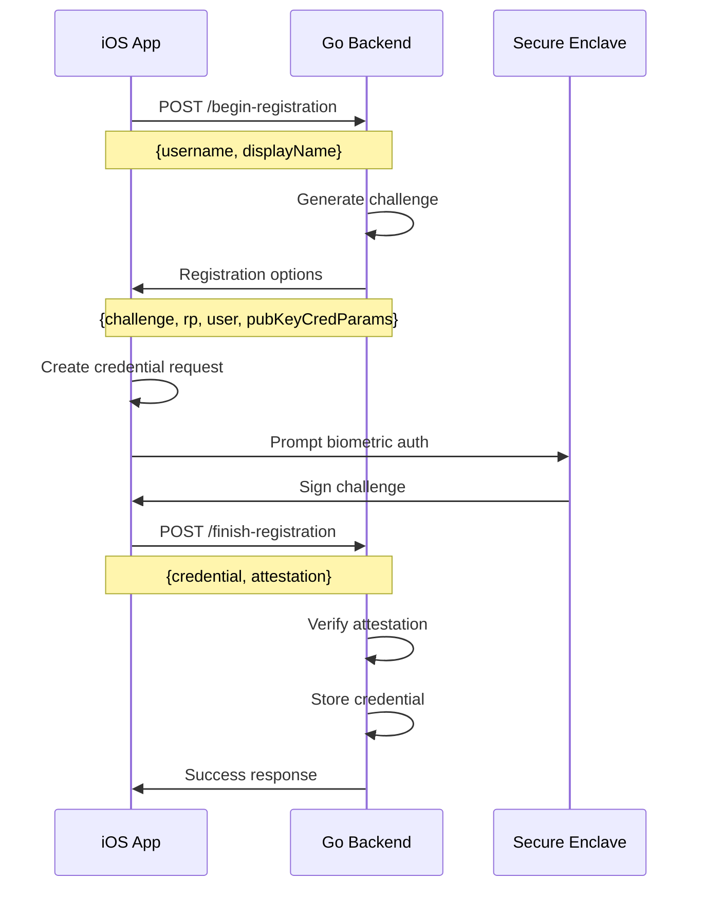
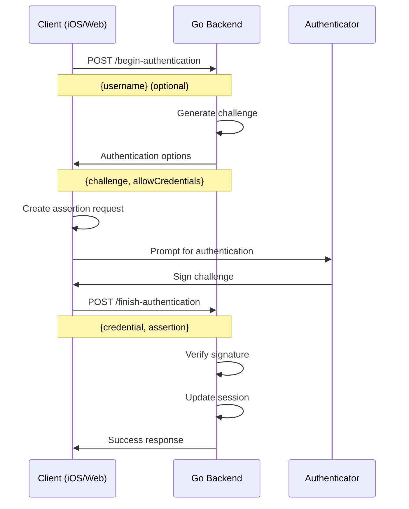

# Architecture Overview

## System Design

The passkey demo implements a complete WebAuthn flow across three platforms:

```
┌─────────────────┐    ┌──────────────────┐    ┌─────────────────┐
│                 │    │                  │    │                 │
│   iOS App       │    │   Web Frontend   │    │   Backend API   │
│   (Swift)       │    │   (React)        │    │   (Go)          │
│                 │    │                  │    │                 │
│ Face ID/Touch ID│◄──►│ Browser WebAuthn │◄──►│ WebAuthn Server │
│ Secure Enclave  │    │ Credential API   │    │ Session Mgmt    │
│ iCloud Keychain │    │ Local Storage    │    │ User Storage    │
│                 │    │                  │    │                 │
└─────────────────┘    └──────────────────┘    └─────────────────┘
         │                       │                       │
         └───────────────────────┼───────────────────────┘
                                 │
                    ┌────────────▼────────────┐
                    │                         │
                    │    Shared Passkeys      │
                    │  (Cross-Platform Sync)  │
                    │                         │
                    └─────────────────────────┘
```

## WebAuthn Flow Implementation

### 1. Registration Flow



### 2. Authentication Flow



## Platform-Specific Implementation

### iOS Frontend (Swift)

**Key Components:**
- `WebAuthnService`: Core authentication logic
- `APIService`: Backend communication with ngrok/localhost detection
- `ASAuthorizationController`: iOS WebAuthn API wrapper

**Security Features:**
- Associated Domains for domain verification
- Secure Enclave for private key storage
- iCloud Keychain for cross-device sync
- Biometric user verification

**Code Structure:**
```swift
// Registration
let platformProvider = ASAuthorizationPlatformPublicKeyCredentialProvider(
    relyingPartyIdentifier: rpid
)
let registrationRequest = platformProvider.createCredentialRegistrationRequest(
    challenge: challengeData,
    name: username,
    userID: userIdData
)
```

### Web Frontend (React)

**Key Components:**
- WebAuthn JavaScript API
- React hooks for state management
- TypeScript for type safety

**Browser APIs:**
```javascript
// Registration
const credential = await navigator.credentials.create({
    publicKey: {
        challenge: challengeBuffer,
        rp: { id: "domain.com", name: "App" },
        user: { id: userIdBuffer, name: username, displayName: displayName },
        pubKeyCredParams: [{ alg: -7, type: "public-key" }]
    }
});

// Authentication
const assertion = await navigator.credentials.get({
    publicKey: {
        challenge: challengeBuffer,
        allowCredentials: allowedCredentials
    }
});
```

### Backend (Go)

**Key Components:**
- `go-webauthn/webauthn`: WebAuthn protocol implementation
- Custom logger with timestamp correlation
- In-memory session and user storage

**Storage Architecture:**
```go
type User struct {
    ID          string
    Username    string
    DisplayName string
    Credentials []webauthn.Credential
}

type SessionData struct {
    Challenge   string
    UserID      string
    AllowedCreds [][]byte
}
```

**API Endpoints:**
- `POST /begin-registration`: Start passkey registration
- `POST /finish-registration`: Complete passkey registration
- `POST /begin-authentication`: Start authentication (with/without username)
- `POST /finish-authentication`: Complete authentication
- `GET /.well-known/apple-app-site-association`: iOS domain verification

## Security Considerations

### Domain Verification

**iOS Associated Domains:**
```xml
<key>com.apple.developer.associated-domains</key>
<array>
    <string>webcredentials:your-domain.ngrok-free.app</string>
</array>
```

**AASA File (Apple App Site Association):**
```json
{
  "webcredentials": {
    "apps": ["TEAM_ID.com.passkey.demo.ios"]
  }
}
```

### RPID (Relying Party ID) Consistency

**Critical requirement:** All platforms must use the same RPID

```go
// Backend configuration
config := &webauthn.Config{
    RPID: "your-domain.ngrok-free.app",
    RPOrigins: []string{"https://your-domain.ngrok-free.app"},
}
```

### Cross-Platform Passkey Sharing

**Requirements for sharing:**
1. Same RPID across all platforms
2. Same user account (Apple ID for iOS/web sync)
3. Proper domain verification on all platforms
4. HTTPS for web (ngrok provides this)

## Development Environment

### ngrok Configuration

**Purpose:** Provides HTTPS domain required for:
- iOS Associated Domains
- WebAuthn origin verification
- Cross-platform passkey sync

**Setup:**
```bash
# Start tunnel
./scripts/start-ngrok.sh

# Configure iOS
cd frontend-swift && ./setup-domain.sh

# Configure backend  
cd ../backend && ./setup-aasa.sh TEAM_ID
```

### Local Development vs Production

**Development (ngrok):**
- Dynamic domains (changes on restart)
- Automated configuration scripts
- In-memory storage for simplicity

**Production considerations:**
- Stable domain names
- Persistent storage (database)
- User authentication and authorization
- Rate limiting and security hardening
- Proper error handling and monitoring

## Data Flow

### Registration Data Flow
1. User enters username/displayName
2. Backend generates cryptographic challenge
3. Platform authenticator creates key pair
4. Private key stored in Secure Enclave/TPM
5. Public key + attestation sent to backend
6. Backend verifies attestation and stores credential

### Authentication Data Flow
1. User initiates authentication (with/without username)
2. Backend sends challenge + allowed credentials
3. Platform authenticator signs challenge with private key
4. Backend verifies signature against stored public key
5. Session established for authenticated user

### Cross-Platform Sync
1. Passkey created on Platform A (iOS)
2. Credential synced to iCloud Keychain
3. User accesses Platform B (web browser)
4. Same passkey available via iCloud Keychain
5. Authentication works seamlessly across platforms

## Performance Considerations

### Backend
- In-memory storage: Fast but non-persistent
- Session management: Simple cookie-based
- No database overhead in demo

### iOS
- Secure Enclave operations: Hardware-accelerated
- iCloud sync: Automatic background process
- Biometric authentication: Near-instantaneous

### Web
- WebAuthn API: Browser-native implementation
- No external dependencies beyond standard APIs
- Minimal JavaScript footprint

## Scalability Notes

**Current limitations (demo):**
- In-memory storage doesn't scale
- No user management system
- Single-server deployment
- No monitoring or analytics

**Production improvements needed:**
- Database storage with proper indexing
- User registration and profile management
- Load balancing and horizontal scaling
- Monitoring, logging, and alerting
- Rate limiting and abuse prevention
- Backup and disaster recovery